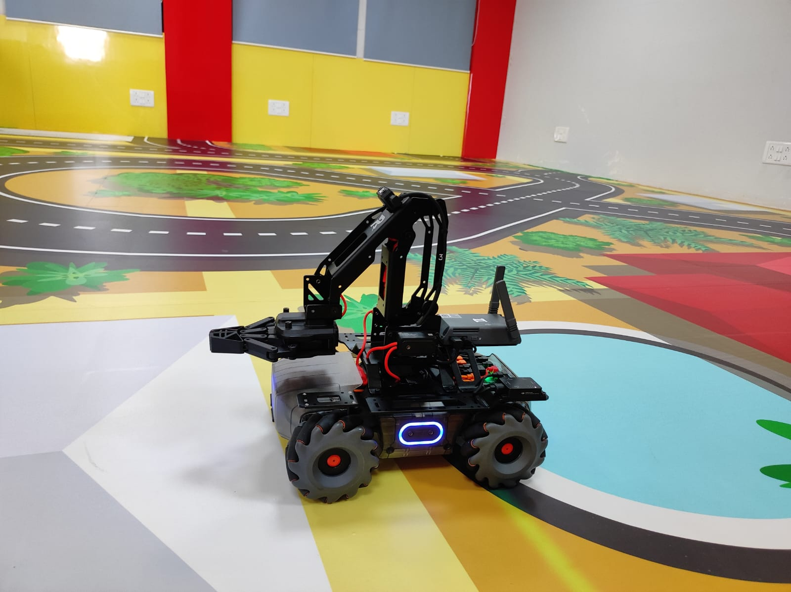
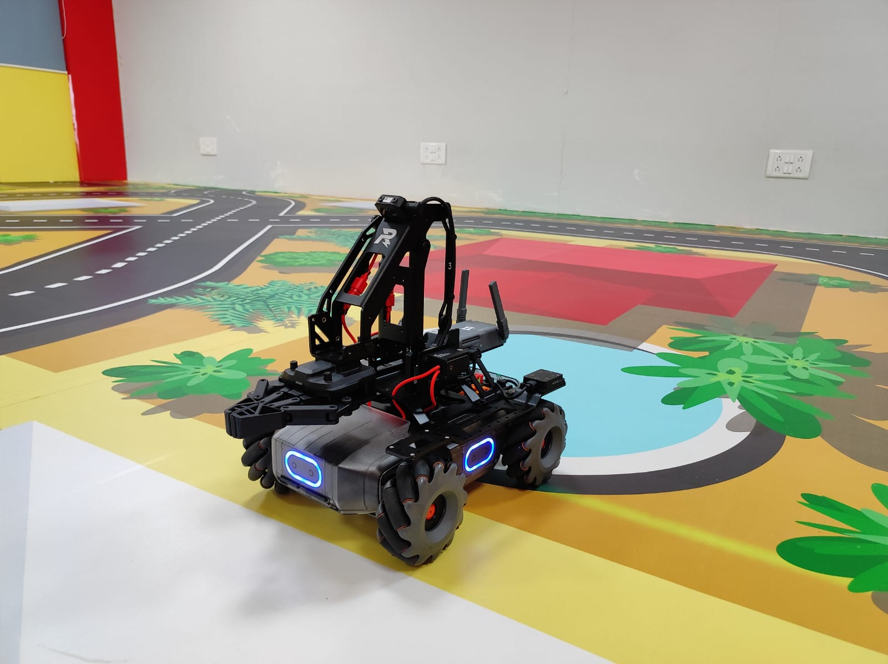

# MobileRobot-Openloopcontrol
## Aim:

To develop a python control code to move the mobilerobot along the predefined path.

## Equipments Required:
1. RoboMaster EP core
2. Python 3.7

## Procedure

Step1:

<br/>Use from robomaster import robot.

Step2:

<br/>Choose the x,y,z - axis movement distance(meters).

Step3:

<br/>Give ep_chassis.move to move straight.

Step4:

<br/>Give time.sleep() for a break.

Step5:

<br/>Give ep_chassis.drive_speed to have a circular movement.

## Program
```python
'''
developed by:vinushcv and team
reg number:22001897
'''

from robomaster import robot
import time
from robomaster import camera

if _name_ == '_main_':
    ep_robot = robot.Robot()
    ep_robot.initialize(conn_type="ap")

    ep_chassis = ep_robot.chassis
    ep_led = ep_robot.led
    ep_camera = ep_robot.camera
    '''
    x = x-axis movement distance,( meters) [-5,5]
    y = y-axis movement distance,( meters) [-5,5]
    z = rotation about z axis ( degree)[-180,180]
    xy_speed = xy axis movement speed,( unit meter/second) [0.5,2]
    '''
    print("Camera streaming started...")
    ep_camera.start_video_stream(display=True, resolution=camera.STREAM_360P)
    ep_chassis.move(x=2, y=0, z=0, xy_speed=0.75).wait_for_completed()
    ep_chassis.move(x=0, y=0, z=-90, xy_speed=1).wait_for_completed()
    for i in range(90):
         ep_led.set_led(comp="all",r=255,g=0,b=0,effect="on")  
         ep_led.set_led(comp="all",r=0,g=255,b=0,effect="on")
         ep_led.set_led(comp="all",r=0,g=0,b=255,effect="on")
    ep_chassis.drive_speed(x=0.3,y=0,z=18)
    time.sleep(8.8)
    ep_camera.stop_video_stream()
    print("Stopped video streaming...")
    

    ep_robot.close()
```

## MobileRobot Movement Image:


Insert image here


<br/>
<br/>
<br/>
<br/>

## MobileRobot Movement Video:

Upload your video in Youtube and paste your video-id here

## video link:
https://www.youtube.com/watch?v=iK5Uy4LFIFI

<br/>
<br/>
<br/>
<br/>

## Result:
Thus the python program code is developed to move the mobilerobot in the predefined path.


<br/>
<br/>

```
Mobile Robotics Laboratory
Department of Artificial Intelligence and Data Science/ Machine Learning
Saveetha Engineering College
```
